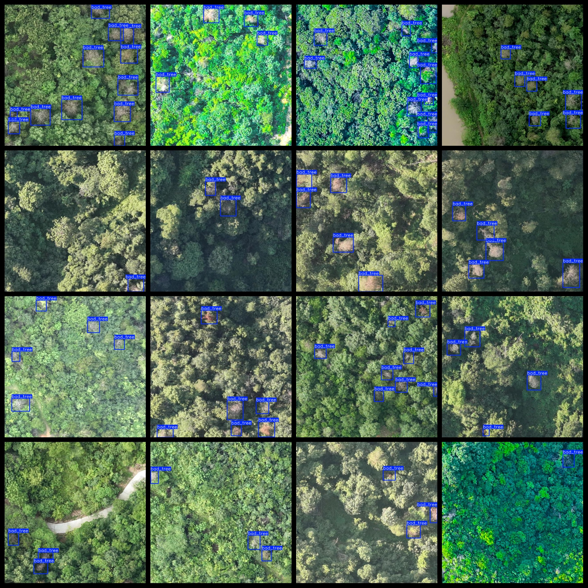

# Forest in Tree Die Detection Dataset 2833 imagesVOC+YOLO format

Tree death detection dataset in forest 2833 VOC + YOLO format

Dataset format: Pascal VOC format + YOLO format (the txt file does not contain the split path, it only contains jpg images and corresponding VOC format xml files and yolo format txt files)

Number of images (number of jpg files): 2833

Number of annotations (number of xml files): 2833

Number of annotations (number of txt files): 2833

Number of categories: 1

The Github repository for the given code is: firc-dataset

Annotation class names: ["bad_tree"]

Number of boxes labeled in each category:

bad_tree frame count = 13208

Total boxes: 13208

Number of images per category:

bad_tree annotated images = 2833

Image resolution: 640x640

Use the labeling tool: labelImg

Rules for annotation: Draw a rectangle around the category.

Important note: The dataset does not have been divided into training, validation, and testing sets.

Special Disclaimer: This dataset does not guarantee the accuracy of the trained models or weight files.

Annotation and image details are as follows:

## Images

---

Here is a pay link on Stripe (https://buy.stripe.com/3cs8yP7sY87d0vu9AB). Please contact me lonlonago@foxmail.com after funding $89, and I will send you a complete data files, thank you!

